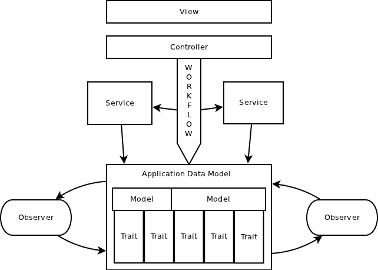

!SLIDE 
# Fighting fat models
## Bogdan Gusiev
### July 2011

!SLIDE 

*Scope* of this presentation:

* Create
* Update 
* Delete

**Not the scope** of this presentation:

* Select

!SLIDE 
##### Why the problem appear?

####All business logic code goes to *model by default*.

 

##### Why it should not be in controller?

#### Because **controller is hard** to test, maintain and reuse.

 

##### Why it should not be in **view**?

#### Because you will burn in **hell** for that

!SLIDE 

## Existing techniques

* Services 
  * Separated utility class
* Observers 
  * Event listeners
* Traits 
  * Modules that get included to models

The problem is to **understand** which one *fit best* for you.

!SLIDE 

## What do we expect?

* *Reusability* of the code
* Context free and easy to *test*
* Making the logic  **strict**

!SLIDE 

## Services

The most common way to extract logic from model:

    @@@ ruby
    module CommentService
      def create(attributes)
        comment = Comment.create!(attributes)
        deliver_notification(comment)
      end
    end

#### "Я знаю откуда что берется"

!SLIDE 
### Service implementations

Support model with service is good idea.

    @@@ ruby

    UserService.create_from_facebook
    # or
    User.create_from_facebook

!SLIDE 

## Services with options

Plan A:

    @@@ ruby
    module CommentService
      def create(attributes, skip_notification = false)
        comment = Comment.create!(attributes)
        unless skip_comment_notification
          deliver_notification(comment)
        end
      end
    end

#### Method will be a **mess** as number of options goes higher.

!SLIDE 

## Service with options

Plan B:

    @@@ ruby
    module CommentService
      def create_with_notification(attributes)
      def create(attributes)
    end

Maintenance problems:

* Hard to keep all team informed about all services in the App
* Don't provide default behavior
* Need to serve too many parameters as you adapt service for edge cases

!SLIDE 

## Observers

    @@@ ruby

    class Comment < AR::Base
      attr_accessor :skip_comment_notification
    end

    class CommentObserver < AR::Observer
      def after_create(comment)
        unless comment.skip_comment_notification
          send_comment_notification(comment)
        end
      end
    end

* Hard to access to model internals
  * Some observer code stays in model
* Have some problems with testing
* Makes the app more fragmented
* "Not done well in Rails"

!SLIDE 
### Benefits of embed thing to model

We create default behavior and our data is safe.

Example: Comment can not be created without notification.

    @@@ ruby
    class Comment < AR::Base
      def after_create
        send_comment_notification
      end
    end

Moreover, no new API invented.

!SLIDE 

### Support parameter in model

Edge cases of data creation. Solved by unpersisted attributes. 

    @@@ ruby
    class Comment < AR::Base
      attr_accessor :skip_comment_notification
      def after_create
        unless self.skip_comment_notification
          send_comment_notification
        end
      end
    end

* Hey model, create my comment.
  * Ok
* Hey model, why did you send the notification?
  * Because you didn't say you don't need it
* Create model without notification
  * Ok

`#skip_comment_notification` is used only in 20% of cases.

!SLIDE 
### The model is still **fat**. What to do?
## *Vertical slicing* with Traits
##### Unlike MVC which is horizontal slicing.

!SLIDE 

### Vertical slicing

Split model into chunks

    @@@ ruby
    class User < AR::Base
      include Traits::User::Facebook
      include Traits::User::Linkedin
      include Traits::State::CanBeDisabled
    end

    module Facebook
      has_one :facebook_profile
      def connected_to_facebook?
      ...
    end

    module CanBeDisabled
      scope :disabled
      scope :enabled
      def disable!
      def disabled?
    end

!SLIDE 

Traits include all staff that can be defined in model

* Scopes
* Associations
* Validation
* Callbacks

!SLIDE 

#### Perfect example of Traits is *ActiveRecord*
##### If it is *possible* for such a **complicated library** 
##### then it is easy for regular projects

!SLIDE 

## Services and Models

####Service stands for *could*

####Model stands for **should**

!SLIDE

### Traits and associations

Associations is a base for Traits technique.

* *`belongs_to`* is a *core* of a model that usually used almost everywhere.
  * This associations is used in almost all methods.
* *`has_many`* is usually *better* to create a slice of functionality.
  * Methods with this associations is usually independent from each other.

!SLIDE 

### Basic application architecture

<table>
<tr>
  <td colspan="3">View</td>
</tr>
<tr>
  <td colspan="3">Controller</td>
</tr>
<tr>
  <td colspan="3" style="padding-top: 0px; padding-bottom: 0px">Thin model</td>
</tr>

<tr>
  <td style="padding-top: 40px; padding-bottom: 40px">Trait</td>
  <td>Trait</td>
  <td>Trait</td>
</tr>

</table>

!SLIDE 

### let's talk about 

### **BIG FAT ENTERPRISE**

!SLIDE 

### Entreprise world

Unlike public web sites that is well focused, Enterprise apps use to do everything.

That is why:

* More huge web forms
* More complicated data structure 
* More significant updates

!SLIDE 

### There is a need to reuse code in services.
## Extract *Workflow* from service.

!SLIDE 

## Workflow

In two words a huge update for the data.

Workflow is perfoming this update.

Parts of workflow that should be reused are extracted to services.

!SLIDE 

## Super advanced logic infrastructure

!SLIDE 

### The **End**

#### Thanks for *watching*

##### [http://gusiev.com](http://gusiev.com)
##### [https://github.com/bogdan](https://github.com/bogdan)
